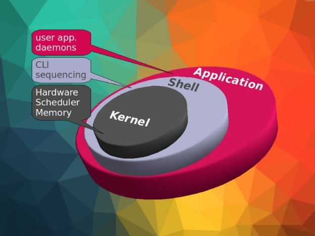
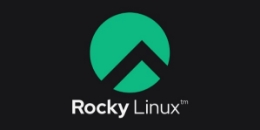
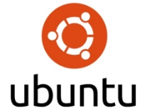

# TỔNG QUAN VỀ HỆ ĐIỀU HÀNH LINUX

## 1. LINUX LÀ GÌ ##

Linux là một họ các hệ điều hành tự do mẫ nguồn mở tương tự Unix và dựa trên Linux kernel, một hạt nhân hệ điều hành được phát hành lần đầu tiên vào ngày 17 tháng 9 năm 1991, bởi Linus Torvalds. Mặc dù có khá nhiều tranh cãi về việc phát âm Linux, nhưng theo như Linus chia sẻ: "Tôi không quá bận tâm việc mọi người phát âm tên tôi như thế nào, nhưng Linux luôn là Lih-nix". Linux thường được đóng gói thành các bản phân phối Linux. Nó có lẽ là một ví dụ nổi tiếng nhất của phần mềm tự do và của việc phát triển mã nguồn mở.

Các bản phân phối bao gồm nhân Linux và các thư viện và phần mềm hệ thống hỗ trợ, nhiều thư viện được cung cấp bởi GNU Project. Nhiều bản phân phôi Linux sử dụng từ "Linux" trong tên của họ, nhưng Free Software Foundation sử dụng tên GNU/Linux để nhấn mạnh tầm quan trọng của phần mềm GNU, gây ra một số tranh cãi.

Linux ban đầu được phát triển cho các máy tính cá nhân dựa trên kiến trúc Intel x86, nhưng sau đó đã được ported sang nhiều nền tảng hơn bất kỳ hệ điều hành nào khác. Do sự thống trị của Android trên điện thoại thông minh, Linux cũng có cơ sở được cài đặt lớn nhất trong tất cả các hệ điều hành có mục đích chung. Mặc dù nó chỉ được sử dụng bởi khoảng 2.3% máy tính để bàn, nhưng Chromebook, chạy Chrome OS dựa trên nhân Linux, thống trị thị trường giáo dục K–12 của Mỹ và chiếm gần 20% doanh số notebook dưới 300 đô la ở Mỹ. Linux là hệ điều hành hàng đầu trên các máy chủ (hơn 96,4% trong số 1 triệu hệ điều hành máy chủ web hàng đầu là Linux), dẫn đầu các hệ thống big iron như các hệ thống mainframe, và là hệ điều hành duy nhất được sử dụng trên các siêu máy tính TOP500 (kể từ tháng 11 năm 2017, đã dần dần loại bỏ tất cả các đối thủ cạnh tranh).

Linux cũng chạy trên các hệ thống nhúng, tức là các thiết bị có hệ điều hành thường được tích hợp vào firmware và được thiết kế riêng cho hệ thống. Điều này bao gồm routers, điều khiển tự động hóa, công nghệ nhà thông minh (giống như Google Nest), TV (các smartTv của Samsung và LG dùng Tizen và WebOS, tương ứng), ô tô (ví dụ, Tesla, Audi, Mercedes-Benz, Hyundai, và Toyota đều dựa trên Linux), máy quay video kỹ thuật số, video game consoles, và smartwatches. Hệ thống điện tử của Falcon 9 và Dragon 2 sử dụng phiên bản Linux tùy biến.

Linux là một trong những ví dụ nổi bật nhất của phần mềm tự do nguồn mở và của việc phát triển mã nguồn mở. Mã nguồn có thể được dùng, sửa đổi và phân phối - thương mại hoặc phi thương mại - bởi bất kỳ ai theo các điều khoản của giấy phép tương ứng, ví dụ như GNU General Public License. 

## 2. DISTRO LINUX

Distro là từ viết tắt thay thế cho Linux Distribution - bản phân phối của Linux - là một hệ điều hành được tập hợp từ nhiều phần mềm dựa trên nhân Linux (Linux Kernel) và thường có một hệ thống quản lý các gói tin. Linux được phát hành dưới dạng mã nguồn mở cho nên đó là lý do tại sao hiện tại có rất nhiều distro (bản phối của Linux). Distro hiểu cơ bản là các hệ điều hành phát triển dựa trên nhân Linux ban đầu. Mỗi Distro sẽ có ưu nhược điểm riêng và được sinh ra để phục vụ một mục đích khác nhau.

### 1. Nhân Linux ( Linux Kernel)

Nhân Linux (kernel) là thành phần cốt lõi của hệ điều hành là lớp cho phép hệ thống quản lý, điều khiển, giao tiếp với các phần cứng của máy tính. Kernel có chứa phần mềm cho phép bạn sử dụng được ổ cứng, mạng, RAM hay các phần cứng khác. Hệ thống Linux dựa theo UNIX, gọi là GNU/Linux. Nhân Linux hiện nay được phát triển bởi cộng đồng nguồn mở dựa trên nhân Linux mới được phát triển bởi Linus Torvalds (phát hình năm 1991).

### 2. Chọn Distro Linux

Sử dụng Linux bạn có thể nghe thấy rất nhiều bản phân phối Linux khác nhau như Ubuntu, Debian, Fedora, Red Hat … (Xem danh sách hàng trăm Distro phổ biến nhất gần đây tại distrowatch) Điều này làm cho việc mới tiếp cận Linux có vẻ lúng túng không biết chọn bản phân phối nào. Mỗi bản phân phối có những đặc tính khác nhau, có thể phân chia để lựa chọn theo ba tiêu chí:

- Mục đích
- Cấu hình và gói ứng dụng
- Mô hình hỗ trợ

**Bản phân phối linux theo mục đích sử dụng:** Mỗi distro được thiết kế cho các mục đích khác nhau, cung cấp trải nghiệm người dùng khác nhau. Một số distro dùng để làm server, một số lại dùng cho môi trường desktop, một số lại có mục đích đặc biệt như hệ thống nhúng. Cho đến nay, các bản Linux được cài đặt nhiều nhất và là để làm các server để chạy các dịch vụ (như website), còn các bản Linux cài đặt tạo môi trường desktop (máy tính cá nhân) vẫn là rất ít nếu so với Windows hay macOS.

**Bản phân phối linux theo cách cấu hình:** Các bản phân phối còn có sự khác nhau chính đó là cách thức thiết lập cấu hình hệ thống của chúng khác nhau. Một số Distro giữ các cấu hình, thiết lập, các file cấu hình ở cùng một nơi (thư mục), một số khác lại lưu ở nhiều nơi trong cấu trúc thư mục. Tiếp theo là quá trình cài đặt, cập nhật các ứng dụng (các gói package) cũng khác nhau tùy vào distro, nhiều distro thực hiện điều này bằng các công cụ quản lý gói (package) như DPKG (debian), APT (ubuntu, debian), RPM (Red Hat), YUM … Do có nhiều trình quản lý gói kiểu này nên thật sự việc quản trị gây khó khi làm việc giữa nhiều distro, ở các bài sau sẽ nói về những công công cụ quản lý gói này.

Bản phân phối linux theo mô hình hỗ trợ: Một số distro được bảo trì, hỗ trợ bởi cộng đồng tình nguyện (Debian, CentOS, Fedora) nhưng cũng có các distro được hỗ trợ bởi các công ty thương mại (RHEL, Ubuntu), dù phần mềm vẫn là nguồn mở nhưng bạn cần trả tiền cho các dịch vụ hỗ trợ.

### 3. Một số Distro Linux

Trước tiên lưu ý có những Distro kế thừa (dựa trên) một Distro khác như CentOS dựa trên Red Hat, Ubuntu dựa trên Debian. Có điều này bởi vì các phần mềm nguồn mở được phép dùng lại bởi các lập trình viên (developer). Các lập trình viện có thể chọn một số tính năng từ một distro và từ đó tạo ra một distro mới, có nhiều distro linux vì có nhiều nhóm lập trình viên tạo ra từ việc kế thừa một distro khác, đặt một tên mới và thêm vào một vài tính năng, thường thì các distro kế thừa giữ các tính năng gần gũi với distro gốc.

|Red Hat Enterprise Linux (RHEL)|Đây là nền tảng thương mại phổ biến (www.redhat.com/rhel/), có hai phiên bản là RHEL (hỗ trợ 2CPU) và RHELAP (không giới hạn CPU). Red Hat được sử dụng bởi các cơ quan, tổ chức. Red Hat và các distro dựa trên nó dùng chương trình quản lý gói có tên là RPM (Red Hat Package Management).|
| - | - |
|CentOS|CentOS (www.centos.org) dựa theo Red Hat Enterprise Linux, dành cho ai muốn sử dụng Red Hat mà kông phải trả phí hỗ trợ để sử dụng nó. Nó cũng dùng trình quản lý gói RPM và các công cụ quản trị tương tự Red Hat.|
|Fedora|Fedora (http://fedoraproject.org/) là bản phân phối có sự tham gia của cộng đồng và Red Hat, nó dựa theo RHEL và cung cấp nền tảng phát triển cho sản phẩm. Do được tài trợ bở Red Hat, Fedora được dùng như bản test các tính năng mới của Red Hat trước khi tính năng đó đưa vào bản thương mại của RHEL, Fedora cũng dùng trình quản lý gói RPM và các công cụ quản trị giống Red Hat.|
|Debian|Debian Linux (www.debian.org) là phiển bản miễn phí, phát triển và phân phổi bởi cộng đồng đông đảo các lập trình viên và người dùng. Debian là tự do, nguồn mở và duy trì dựa trên những yêu cầu mà người dùng mong muốn (xem hợp đồng xã hội của Diabian https://www.debian.org/social\_contract). Quản lý gói trên Debian là dpkg tại đó có tới 23000 ứng dụng, công cụ sẵn sàng để cài đặt.|
|Ubuntu|

Đây là bản phân phối miễn phí (www.ubuntu.com/) dựa trên Debian với vòng đời phát triển, cập nhật cứ 6 tháng một. Nó cũng có hỗ trợ thương mại dành cho các tổ chức. Ubuntu được sử dụng với với nhiều mục đích khác nhau gồm cả desktop và server. Nhiều người nhận định Ubuntu là một phân phối Linux dễ hiểu, dễ sử dụng, mang lại trải nghiệm người dùng tốt nhất. Nó cũng sử dụng trình quản lý gói giống Debian và các công cụ quản trị của nó.
|
|Gentoo|Gentoo (www.gentoo.org/) là phiên bản cộng đồng – miễn phí, cung cấp các tùy chọn để biên dịch ra bản Linux tùy thuộc vào phần cứng của bạn, nó không cung cấp bản đã biên dịch ứng dụng nào mà hầu hết bạn sẽ tự biên dịch từ mã nguồn. Trong các Distro trên nếu dùng ở môi trường Desktop nên chọn Ubuntu, nếu dùng làm Server có thể chọn CentOS, Ubuntu Server.|

## III. CENTOS END OF LIFE VÀ CÁC DISTRO THAY THẾ
### 1. Tóm tắt sự kiện
#### a. Sự ra đời

Trước khi được biết đến dưới tên hiện tại, CentOS có nguồn gốc là một sản phẩm của CAOS Linux, được khởi động bởi Gregory Kurtzer. Tháng 6/2006, David Parsley, nhà phát triển chính của Tao Linux (một nhân bản khác của RHEL), thông báo ngừng phát triển Tao Linux chuyển sang phát triển CentOS. Người dùng Tao chuyển sang CentOS thông qua yum update.

Vào tháng 7 năm 2010, CentOS đã vượt qua Debian để trở thành bản phân phối Linux phổ biến nhất cho các máy chủ web, với gần 30% tất cả các máy chủ web Linux sử dụng nó. Debian lấy lại vị trí dẫn đầu vào tháng 1 năm 2012. Tháng 1/2014, Red Hat thông báo họ trở thành nhà bảo trợ của dự án CentOS, "giúp thiết lập một nền tảng phù hợp với nhu cầu của các nhà phát triển nguồn mở tích hợp các công nghệ trong và xung quanh hệ điều hành". Do những thay đổi này, quyền sở hữu thương hiệu CentOS đã được chuyển sang Red Hat, hiện đang sử dụng hầu hết các nhà phát triển đầu của CentOS; tuy nhiên, họ hoạt động như một phần của nhóm Open Source and Standards của Red Hat, hoạt động tách biệt với nhóm Red Hat Enterprise Linux. Một ban quản trị mới của CentOS cũng được ra mắt.

Số phiên bản của CentOS nhỏ hơn 7.0 có hai phần, một phiên bản chính và một phiên bản nhỏ, tương ứng với phiên bản chính và cập nhật của Red Hat Enterprise Linux được sử dụng để xây dựng là phiên bản của CentOS. Ví dụ, CentOS 6.5 được xây dựng từ các gói nguồn của RHEL 6 update 5 (còn được biết là RHEL version 6.5), cái gọi là "phát hành điểm" của RHEL 6.

Bắt đầu với phiên bản 7.0, CentOS số phiên bản cũng bao gồm một phần thứ ba chỉ ra dấu thời gian của mã nguồn phát hành dựa trên. Ví dụ: số phiên bản 7.0-1406 vẫn ánh xạ bản phát hành CentOS này sang bộ cập nhật zeroth của RHEL 7, trong khi "1406" chỉ ra rằng mã nguồn phát hành này dựa trên ngày từ tháng 6 năm 2014. Sử dụng tháng tháng cho phép hình ảnh cài đặt được phát hành lại để phát hành container và đám mây sắp tới, trong khi vẫn duy trì kết nối với phiên bản phát hành cơ sở có liên quan.

Từ giữa 2006, bắt đầu với phiên bản 4.4 (chính thức được gọi là Red Hat Enterprise Linux 4.0 update 4, Red Hat đã thông qua một quy ước phiên bản giống hệt của CentOS (ví dụ, RHEL 4.5 hay RHEL 6.5).

#### 1. End of life

CentOS, một trong những hệ điều hành Linux phổ biến nhất trên thế giới, đã chính thức thông báo về việc kết thúc chu kỳ hoạt động (EOL) của CentOS 8 vào tháng 12 năm 2021. Quyết định này đã gây ra sự chú ý lớn trong cộng đồng người dùng Linux và người quản trị hệ thống do CentOS được sử dụng rộng rãi trong các môi trường sản xuất và doanh nghiệp.

**Nguyên nhân chính** dẫn đến quyết định kết thúc chu kỳ hoạt động của CentOS 8 là sự thay đổi chiến lược của CentOS Project sau khi Red Hat, công ty mẹ của CentOS, công bố chương trình CentOS Stream vào năm 2019. CentOS Stream được xác định là một phiên bản trung gian giữa Fedora và Red Hat Enterprise Linux (RHEL), với mục tiêu là cung cấp cho người dùng một nền tảng phát triển và kiểm tra các tính năng mới trước khi chúng được triển khai vào RHEL. Điều này đã dẫn đến sự phân tán của cộng đồng CentOS và sự bất mãn từ phía người dùng do mất đi tính ổn định và dự đoán trong việc cập nhật.

Với việc CentOS kết thúc chu kỳ hoạt động, người dùng sẽ không còn nhận được bất kỳ bản vá bảo mật hoặc cập nhật nào từ CentOS Project. Điều này tạo ra một lỗ hổng bảo mật lớn, đặc biệt là đối với các doanh nghiệp và tổ chức có yêu cầu cao về tính bảo mật và ổn định hệ thống.

[CentOS EOL - Redhat](https://www.redhat.com/en/topics/linux/centos-linux-eol)

### 2. **Các Distro Linux thay thế**
#### a. **Alpine Linux**

Alpine Linux là một bản phân phối Linux hướng đến sự tối giản, cả về không gian và phạm vi, cũng như tính bảo mật cao hơn. Phương tiện cài đặt mặc định chỉ có 133 MB. Alpine nổi lên sau khi Docker được phát triển bởi vì nó nhỏ và nhẹ, thường được sử dụng để làm docker image.

[Alpine Linux](https://alpinelinux.org/)

#### b. **Rocky Linux**

Rocky Linux là một dự án được tạo ra nhằm mục đích cung cấp một giải pháp thay thế hoàn toàn cho CentOS. Dự án này được tạo ra bởi Gregory Kurtzer, người sáng lập của CentOS cũ, với mục tiêu là tạo ra một phiên bản ổn định và tương thích hoàn toàn với RHEL.

[Rocky Linux](https://rockylinux.org/)

#### c. **CentOS Stream**

Mặc dù CentOS Stream không phải là một lựa chọn thay thế trực tiếp cho CentOS 8, nhưng nó vẫn được Red Hat khuyến khích là một nền tảng thích hợp cho các dự án phát triển và kiểm tra mới. Với CentOS Stream, người dùng có thể tiếp tục nhận được các cập nhật và tính năng mới trước khi chúng được triển khai vào RHEL.

[CentOS Stream](https://centos.org/centos-stream/)

#### d. **Ubuntu Server**

Ubuntu Server là một lựa chọn hợp lý cho những người dùng muốn thử nghiệm một hệ điều hành mới. Với một cộng đồng lớn và sự hỗ trợ từ Canonical, Ubuntu Server cung cấp một môi trường ổn định và đáng tin cậy cho các ứng dụng doanh nghiệp và cá nhân.

[Ubuntu Server](https://ubuntu.com/)

### 3. **Lưu ý trước khi chuyển đổi**
#### a. **Đánh Giá Nhu Cầu và Yêu Cầu Của Bạn**

Trước thông tin CentOS End of life như vậy, hẳn là sẽ có nhiều trường hợp quyết định chuyển đổi sang một hệ điều hành mới cho phù hợp, quan trọng là đánh giá nhu cầu và yêu cầu cụ thể của bạn.

Xác định các ứng dụng và dịch vụ quan trọng mà hệ thống của bạn đang chạy và đảm bảo rằng hệ điều hành mới có thể đáp ứng được chúng.

#### b. **Lập Kế Hoạch Chuyển Đổi**

Sau khi đã xác định được hệ điều hành mới phù hợp, bạn cần lập kế hoạch chuyển đổi một cách cẩn thận.

Đảm bảo rằng bạn đã sao lưu dữ liệu quan trọng và tạo ra một kế hoạch thử nghiệm và triển khai.

Thử nghiệm trước khi triển khai trên một môi trường sản xuất giúp giảm thiểu rủi ro và đảm bảo một chuyển đổi suôn sẻ

#### c. **Đảm Bảo Tương Thích**

Khi chuyển đổi sang một hệ điều hành mới, đảm bảo rằng các ứng dụng và dịch vụ của bạn hoạt động một cách mượt mà trên nền tảng mới.

Kiểm tra tính tương thích của phần mềm và phần cứng trước khi thực hiện triển khai có thể giúp bạn tránh được các vấn đề không mong muốn sau này.

[Hướng dẫn chuyển từ CentOS sang Ubuntu](https://phoenixnap.com/kb/migrate-centos-to-ubuntu)

*Chúc bạn đọc một ngày vui vẻ!*

